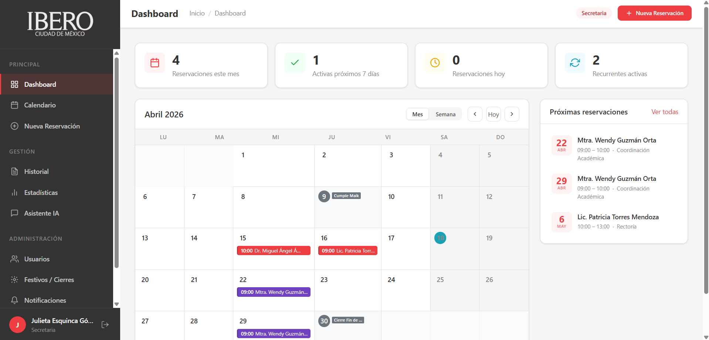

# 📋 Plataforma de Gestión y Reservación de Sala de Juntas

**Iberoamericana — Proyecto Ingeniería de Software 2026**

Sistema interactivo para gestionar reservaciones de salas de juntas en la Universidad Iberoamericana, construido con **HTML5 puro + CSS3 + JavaScript Vanilla**.



---

## 🎯 Características Principales

### Para Secretarias
- ✅ Crear, editar y cancelar reservaciones
- ✅ Detección automática de conflictos de horario
- ✅ Reservaciones recurrentes (semanal, quincenal, mensual)
- ✅ Gestión de usuarios
- ✅ Configuración de días festivos y cierres institucionales
- ✅ Búsqueda y filtrado avanzado
- ✅ Exportación a PDF y Excel
- ✅ Dashboard con estadísticas de ocupación
- ✅ Panel IA para creación inteligente de reservaciones

### Para Académicos
- 👁️ Vista de calendario en solo lectura
- 👁️ Consulta de disponibilidad de salas
- 👁️ Filtrado de reservaciones

---

## 🚀 Inicio Rápido

### Requisitos
- Navegador moderno (Chrome, Firefox, Safari, Edge)
- Servidor web local (opcional, para desarrollo)

### Instalación
```bash
# Clonar el repositorio
git clone <repository-url>
cd sala-juntas-ibero

# Abrir en navegador
# Opción 1: Abrir index.html directamente
# Opción 2: Servir con servidor local
python3 -m http.server 8000
# Luego abrir http://localhost:8000
```

### Credenciales de Demo
```
SECRETARIA:
  Usuario: julieta.esquinca@ibero.mx
  Contraseña: Admin123!

ACADÉMICO:
  Usuario: miguel.alvarez@ibero.mx
  Contraseña: Acad456!
```

---

## 📁 Estructura del Proyecto

```
sala-juntas-ibero/
├── index.html              # Página de login
├── dashboard.html          # Dashboard principal (Secretaria)
├── calendar.html           # Vista calendario
├── reservacion.html        # Formulario reservación
├── admin.html              # Panel administración
├── historial.html          # Historial y búsqueda
├── estadisticas.html       # Dashboard estadísticas
├── ai-panel.html           # Panel IA
│
├── css/                    # Estilos
│   ├── variables.css       # Diseño tokens
│   ├── base.css            # Estilos globales
│   ├── components/         # Componentes UI
│   └── pages/              # Estilos por página
│
├── js/                     # Lógica de aplicación
│   ├── core/               # Núcleo (store, router, utils)
│   ├── modules/            # Módulos funcionales
│   ├── components/         # Componentes reutilizables
│   └── pages/              # Lógica por página
│
├── data/                   # Datos mock y configuración
└── assets/                 # Imágenes y recursos
```

**Ver [`INSTRUCCIONES_CLAUDE_CODE.md`](./.claude/CLAUDE.md) para documentación técnica completa.**

---

## 🛠️ Tecnologías

| Componente | Tecnología |
|-----------|-----------|
| Estructura | HTML5 semántico |
| Estilos | CSS3 + Variables |
| Lógica | JavaScript ES6+ (Vanilla) |
| Almacenamiento | localStorage (prototipo) |
| Gráficas | Chart.js |
| Exportación | jsPDF, SheetJS |
| Iconos | Feather Icons |

---

## 📊 Flujo de Desarrollo

El proyecto se divide en 4 fases:

1. **FASE 1: Fundamentos** — Autenticación y estructura base
2. **FASE 2: Calendario** — Vista calendario con reservaciones
3. **FASE 3: Reservaciones** — CRUD completo con validaciones
4. **FASE 4: Avanzado** — Historial, búsqueda, IA, estadísticas

Ver documentación detallada en `.claude/CLAUDE.md` (Sección 6).

---

## 🎨 Diseño

- **Paleta:** Rojo Ibero (#ef3e42) + escala de grises
- **Tipografía:** Sistema de fuentes nativo (sans-serif)
- **Responsive:** Mobile-first (320px, 768px, 1200px)
- **Accesibilidad:** WCAG 2.1 AA en desarrollo

---

## 📝 Historias de Usuario

Total: **33 Historias de Usuario** organizadas en **10 Épicas**

| Épica | Descripción | Historias |
|-------|-----------|-----------|
| É-01 | Autenticación | HU-01 a HU-03, HU-21, HU-22 |
| É-02 | Calendario | HU-04 a HU-07 |
| É-03A | Reservaciones (Secretaria) | HU-08 a HU-12, HU-17 |
| É-03B | Consulta (Académico) | HU-13, HU-14, HU-27 |
| É-04 | Datos Reservación | HU-15, HU-16 |
| É-05 | Respaldos | HU-18, HU-19 |
| É-06 | Historial | HU-20 |
| É-07 | Notificaciones | HU-23, HU-24, HU-25 |
| É-08 | Búsqueda | HU-26, HU-28 |
| É-09 | Reportes | HU-29, HU-30 |
| É-10 | IA | HU-31, HU-32, HU-33 |

---

## 💾 Almacenamiento de Datos

**Prototipo (Actual):** localStorage
- Perfecto para demostración
- Sin dependencias externas
- Datos se pierden al limpiar navegador

**Producción:** PostgreSQL + Node.js/Express
- Ver `.claude/CLAUDE.md` Sección 7 para detalles
- Implementación futura recomendada

---

## 🔐 Seguridad

- Validación de entrada en cliente y servidor
- Protección contra XSS
- Protección contra traslapes de horario
- Timeout de sesión: 30 minutos
- Roles diferenciados (secretaria / académico)

---

## 🤝 Equipo

- **Líder:** Wendy Elizabeth Guzmán Orta
- **Patrocinadora:** Julieta Esquinca Gómez
- **Institución:** Universidad Iberoamericana

---

## 📚 Documentación

- **[INSTRUCCIONES_CLAUDE_CODE.md](./.claude/CLAUDE.md)** — Documentación técnica completa (33 secciones)
- **[Estructura Técnica](./.claude/CLAUDE.md#sección-2-arquitectura-de-la-aplicación)** — Diagrama y arquitectura
- **[User Stories](./.claude/CLAUDE.md#sección-1-análisis-de-historias-de-usuario-y-flujos)** — Especificaciones de funcionalidad

---

## 🐛 Reportar Problemas

Reporta bugs o sugerencias en:
- GitHub Issues (si aplica)
- O contacta al equipo de desarrollo

---

## 📄 Licencia

Proyecto académico — Universidad Iberoamericana (2026)

---

**Última actualización:** 18 de Abril, 2026
